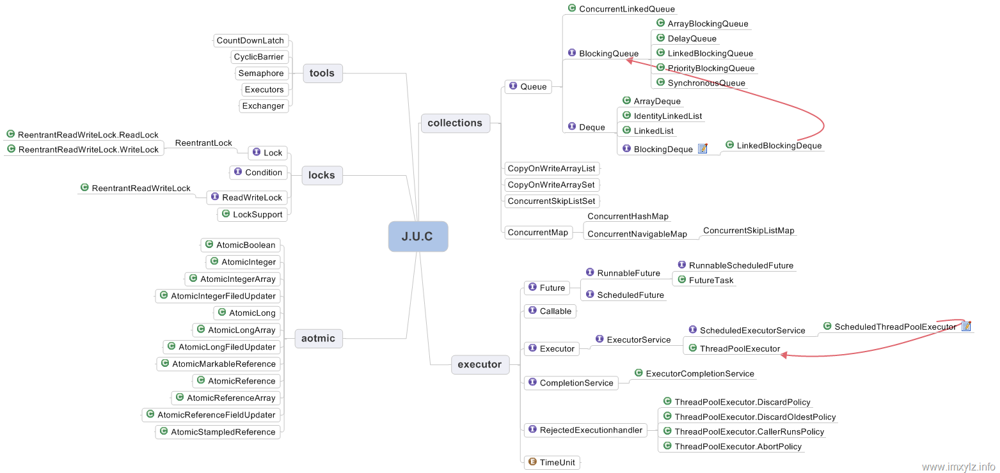

### 14 Lock和Condition：
#### monitor in Java.util.concurrent

并发两大问题:互斥&同步
Java SDK并发包通过Lock和Condition两个接口来实现管城,其中Lock用于解决互斥问题,Condition用于解决同步问题.
与synchronized无法解决死锁造成的"破坏不可抢占条件"相比,Lock的三个接口专门解决该问题:
1. 能够响应中断
synchronized的问题是,持有锁A后,如果尝试获取锁B失败,则线程进入阻塞状态,一旦死锁,就没有任何机会来唤醒阻塞的线程.但如果阻塞的线程能够响应中断信号从而被唤醒,那它就有机会释放锁A.
e.g.
``` bash
// 支持中断的API
void lockInterruptibly()
    throws InterruptedException;
```

2. 支持超时
如果线程超时后没有获取锁不是进入阻塞状态,而是返回一个error,那这个线程也有机会释放锁,也能破坏不可抢占条件.
e.g.
``` bash
boolean tryLock(long time,TimeUnit unit)
    throws InterruptedException;
```

* 3. 非阻塞地获取锁
如果尝试获取锁失败并不进入阻塞状态而是直接返回,也有机会放锁.
e.g.
``` bash
boolean tryLock();
```
#### Java SDK如何保证可见性
 Java 里多线程的可见性是通过 Happens-Before 规则保证的，而 synchronized 之所以能够保证可见性，也是因为有一条 synchronized 相关的规则：synchronized 的解锁 Happens-Before 于后续对这个锁的加锁。那 Java SDK 里面 Lock 靠什么保证可见性呢？例如在下面的代码中，线程 T1 对 value 进行了 +=1 操作，那后续的线程 T2 就能够看到 value 的正确结果
try{}finally{}示例:
``` bash
class X {
    private final Lock rtl =
    new ReentrantLock();
    int value;
    public void addOne() {
        // 获取锁
        rtl.lock();
        try {
            value +=1;
        } finally {
            // 保证锁能释放
            rtl.unlock();
        }
    }
}
```
#### Java SDK中锁的实现简要解释
利用volatile相关的Happens-Before规则,Java SDK里的ReentrantLock内部持有一个volatile的成员变量state,获取锁或者解锁的时候会读写state的值,据相关Happens-Before规则:
1. 顺序性规则：对于线程 T1，value+=1 Happens-Before 释放锁的操作 unlock()；
2. volatile 变量规则：由于 state = 1 会先读取 state，所以线程 T1 的 unlock() 操作 Happens-Before 线程 T2 的 lock() 操作；
3. 传递性规则：线程 T1 的 value+=1  Happens-Before 线程 T2 的 lock() 操作。
``` bash
class SampleLock {
  volatile int state;
  // 加锁
  lock() {
    // 省略代码无数
    state = 1;
  }
  // 解锁
  unlock() {
    // 省略代码无数
    state = 0;
  }
}
```
第二节Java内存模型中有详细解释

### 可重入锁ReentrantLock
定义:指的是线程可以重复获取同一把锁。例如下面代码中，当线程 T1 执行到 ① 处时，已经获取到了锁 rtl ，当在 ① 处调用 get() 方法时，会在 ② 再次对锁 rtl 执行加锁操作。此时，如果锁 rtl 是可重入的，那么线程 T1 可以再次加锁成功；如果锁 rtl 是不可重入的，那么线程 T1 此时会被阻塞。如下:
``` bash
class X {
    private final Lock rtl =
    new ReentrantLock();
    int value;
    public int get() {
        //get lock
        rtl.lock();            b
        try {
            return value;
        } finally {
            // ensure the lock is open
            rtl.unlock();
        }
    }
    public void addOne() {
        // get lock
        rtl.lock();
        try {
            value = 1 + get(); a
        } finally {
            // ensure the lock the is open
            rtl.unlock();
        }
    }
}
```
#### 公平锁与非公平锁
在使用ReentrantLock的时候,有两个构造函数,一个无参,一个传fair参数.fair为公平策略,如果传true就需要构造一个公平锁,反之则表示构造非公平锁.关于非公平锁的应用场景,在线程释放锁之后,如果来了一个线程获取锁,不必去排队直接获取到,不会入队.
``` bash
// unfair lock
public ReentrantLock() {
    sync = new NonfairSync();
}
// create lock according to fair strategy
public ReentrantLock(boolean fair){
    sync = fair ? new FairSync()
                : new NonfairSync();
}
```
#### 锁实践
Doug Lea《Java 并发编程：设计原则与模式》一书中，推荐的三个用锁的最佳实践：
1. 永远只在更新对象的成员变量时加锁
2. 永远只在访问可变的成员变量时加锁
3. 永远不在调用其他对象的方法时加锁

#### 总结与思考
Java SDK 并发包里的 Lock 接口里面的每个方法都是经过深思熟虑的。除了支持类似 synchronized 隐式加锁的 lock() 方法外，还支持超时、非阻塞、可中断的方式获取锁.判断下列代码是否死锁:
``` bash
class Account {
  private int balance;
  private final Lock lock
          = new ReentrantLock();
  // transfer money
  void transfer(Account tar, int amt){
    while (true) {
      if(this.lock.tryLock()) {
        try {
          if (tar.lock.tryLock()) {
            try {
              this.balance -= amt;
              tar.balance += amt;
            } finally {
              tar.lock.unlock();
            }
          }//if
        } finally {
          this.lock.unlock();
        }
      }//if
    }//while
  }//transfer
}
```
* 这个会造成活锁,两个线程同时执行,线程A获取了u1.trylock,线程B获取了u2.trylock,线程A尝试获取u2.trylock,不能成功,线程A结束,同时线程B尝试获取u1.trylock,不能成功,线程B结束,又开始新一轮.A,B俩账户互相转账,各自持有自己的lock的锁,都一直尝试获取对方的锁,形成了活锁.如果在单机单核场景,活锁的可能性很小,可以接受.
改良:
``` bash
class Account {
  private int balance;
  private final Lock lock
          = new ReentrantLock();
  // transfer
  void transfer(Account tar, int amt){
boolean flag = true;
    while (flag) {
      if(this.lock.tryLock(随机数，NANOSECONDS)) {
        try {
          if (tar.lock.tryLock(随机数，NANOSECONDS)) {
            try {
              this.balance -= amt;
              tar.balance += amt;
flag = false;
            } finally {
              tar.lock.unlock();
            }
          }//if
        } finally {
          this.lock.unlock();
        }
      }//if
    }//while
  }//transfer
}
```

### 15 Lock和Condition：
#### how Dubbo achieve transferring asynchronous to synchronous by using monitor

* condition实现了管程模型里的条件变量
Java 语言内置的管程里只有一个条件变量，而 Lock&Condition 实现的管程是支持多个条件变量的，这是二者的一个重要区别。在很多并发场景下，支持多个条件变量能够让我们的并发程序可读性更好，实现起来也更容易。例如，实现一个阻塞队列，就需要两个条件变量。
