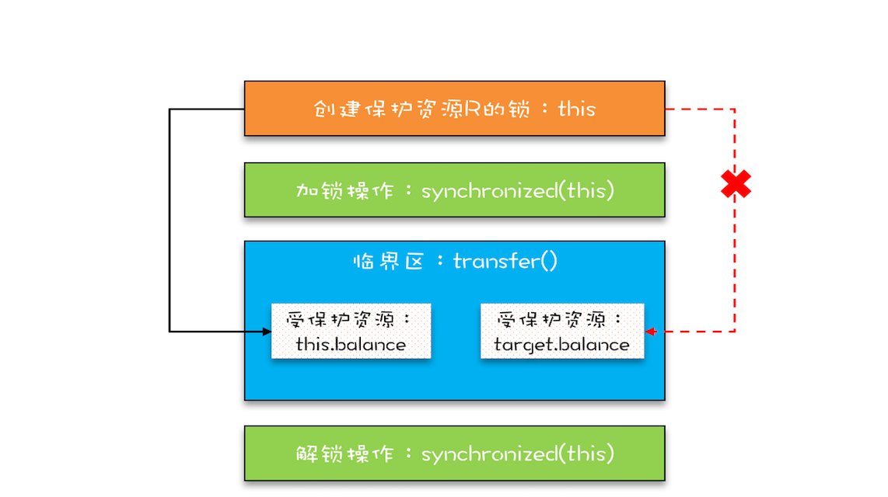
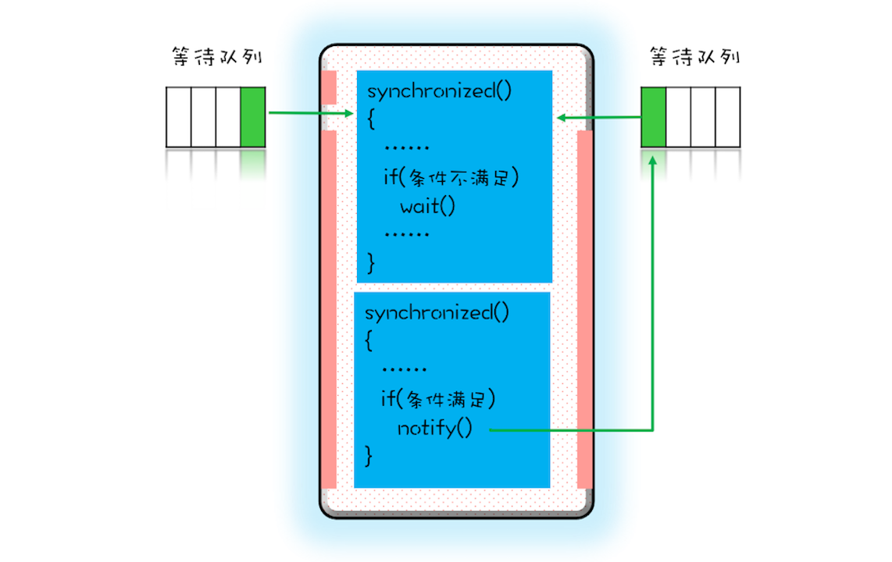
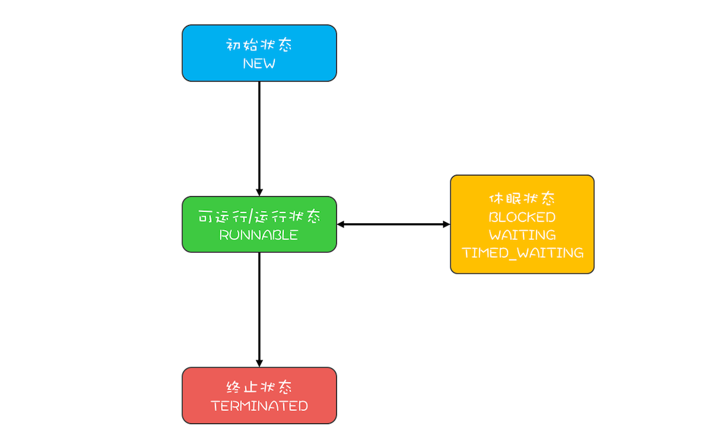
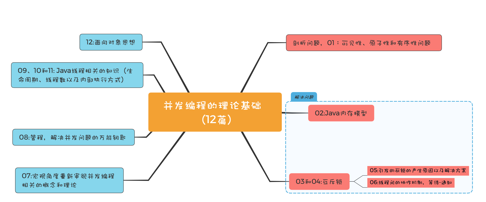

<script type="text/javascript" src="http://cdn.mathjax.org/mathjax/latest/MathJax.js?config=default"></script>

### 01 可见性、原子性、有序性：并发的bug源头

1. 在 32 位的机器上对 long 型变量进行加减操作存在并发隐患？<br>
 long类型64位，所以在32位的机器上，对long类型的数据操作通常需要多条指令组合出来，无法保证原子性，所以并发的时候会出问题
---
2. 进程与线程 
进程不占有CPU。操作系统会把CPU分配给线程。分到CPU的线程就能执行。
并行，是同一时刻，两个线程都在执行。并发，是同一时刻，只有一个执行，但是一个时间段内，两个线程都执行了。
---
3. volatile
* volatile 是一个类型修饰符。作为指令关键字，确保本条指令不会因编译器的优化而省略。
* volatile 的特性:(1) 保证了不同线程对这个变量进行操作时的可见性，即一个线程修改了某个变量的值，这新值对其他线程来说是立即可见的。(2) 禁止进行指令重排序。（实现有序性）(3) volatile 只能保证对单次读/写的原子性。i++ 这种操作不能保证原子性。
* volatile 的实现原理:(1) 变量的内存可见性是基于内存屏障（Memory Barrier）实现。内存屏障，又称内存栅栏，是一个 CPU 指令。
在程序运行时，为了提高执行性能，编译器和处理器会对指令进行重排序，JMM 为了保证在不同的编译器和 CPU 上有相同的结果，通过插入特定类型的内存屏障来禁止特定类型的编译器重排序和处理器重排序，插入一条内存屏障会告诉编译器和 CPU：不管什么指令都不能和这条 Memory Barrier 指令重排序。

### 02 Java内存模型：看Java如何解决可见性和有序性问题
1. 什么是Java内存模型
Java 内存模型规范了 JVM 如何提供按需禁用缓存和编译优化的方法。具体来说，这些方法包括 volatile、synchronized 和 final 三个关键字，以及六项 Happens-Before 规则，这也正是本期的重点内容
``` bash
class VolatileExample {
  int x = 0;
  volatile boolean v = false;
  public void writer() {
    x = 42;
    v = true;
  }
  public void reader() {
    if (v == true) {
      // 这里x会是多少呢？
    }
  }
}
```
* 以上例子中，线程A执行writer方法并将V=true写入内存，B执行reader方法从内存中读取变量v,如果B看到v==true，那B看到的x是多少？
在1.5之前可能会出现x=0，因为CPU缓存的可见性问题。1.5之后已解决。具体就是对volatile的语义进行了增强——Happens-before规则。
2. Happens-Before 规则：
前面一个操作的结果对后续操作是可见的。共有6项：(1) 程序的顺序性规则；（2） volatile 变量规则 （3） 传递性 （4） 管程中锁的规则：管程在java中指synchronized，指synchronized对Java里对管程的实现；
``` bash

synchronized (this) { //此处自动加锁
  // x是共享变量,初始值=10
  if (this.x < 12) {
    this.x = 12; 
  }  
} //此处自动解锁
```
如上，管程中的锁在java里为隐式实现，在进入同步块前会自动加锁，执行完会自动释放锁，加锁和释放锁都是编译器实现的。所以结合规则 4——管程中锁的规则，可以这样理解：假设 x 的初始值是 10，线程 A 执行完代码块后 x 的值会变成 12（执行完自动释放锁），线程 B 进入代码块时，能够看到线程 A 对 x 的写操作，也就是线程 B 能够看到 x==12。这个也是符合直觉的。
（5） 线程start() 规则：主线程A启动子线程B后，子线程B可以看到主线程在启动子线程B前的操作。 （6） 线程join() 规则：主线程通过调用子线程B的join()并成功返回，主线程能看到子线程的操作。

* 被忽视的final规则
* final 修饰变量时，初衷是告诉编译器：这个变量生而不变，可以优化。
3. 有一个共享变量 abc，在一个线程里设置了 abc 的值 abc=3，思考一下，有哪些办法可以让其他线程能够看到abc==3？
（1） 声明共享变量abc，并使用volatile关键字修饰abc；
（2） 声明共享变量abc，在synchronized关键字对abc的赋值代码块加锁，由于happen-before管程锁的规则，可以使得后续线程看到abc的值。
（3） A线程启动后，使用A.JOIN()方法来完成运行，后续线程再启动。
* Java 内存模型主要分为两部分，一部分面向编写并发程序的应用开发人员，另一部分是面向 JVM 的实现人员的，也就是和编写并发程序相关的部分，这部分内容的核心就是 Happens-Before 规则。

### 03 互斥锁：解决原子性问题
如下图：

* 保护资源R就得为它创建一把锁LR；
* 针对这把锁LR，需在进出临界区时添入加锁操作和解锁操作。
1. Java提供的锁技术：synchronized
* synchronized可以用来修饰代码块：
``` bash
class X {
  // 修饰非静态方法
  synchronized void foo() {
    // 临界区
  }
  // 修饰静态方法
  synchronized static void bar() {
    // 临界区
  }
  // 修饰代码块
  Object obj = new Object()；
  void baz() {
    synchronized(obj) {
      // 临界区
    }
  }
}  
```
上式看到修饰静态方法的时候锁定了一个obj对象。此处有一个Java隐式规则：
* 当修饰静态方法的时候，锁定的是当前类的Class对象，在上面的例子即为Class X;当修饰非静态方法的时候，锁定的是当前实例对象this。

* synchronized 修饰静态方法相当于：
``` bash
class X {
    //修饰静态方法
    synchronized(X.class) static void bar() {
        //临界区
    }
}
```
修饰非静态方法：
``` bash
class X {
    // 修饰非静态方法
    synchronized(this) void foo() {
        //临界区
    }
}
```
2. 用synchronized解决count+=1 问题
``` bash
class SafeCalc {
    long value = 0L;
    long get() {
        return value;
    }
    synchronized void addOne() {
        value += 1;
    }
}
```
* addOne()方法被修饰后，无论单核&多核CPU，只有一个线程能够执行它，所以可以保证原子操作。
* 由此引出的可见性问题，可以参考之前的Happens-Before，即前一个线程在临界区修改的共享变量（该操作在解锁之前），对后续进入临界区（该操作在加锁之后）的线程是可见的。所以多个线程同时执行addOne()方法是可以保证可见性的。
* get()方法可见性是无法保证的。管程中锁的规则，是只保证后续对这个锁的加锁的可见性，而get()方法并没有加锁操作，解决方案：get()方法也synchronized：
``` bash
class SafeCalc {
    long value = 0L;
    synchronized long get() {
        return value;
    }
    synchronized void addOne() {
        value += 1;
    }
}
```
3. 锁与受保护资源的关系

4. 下面的代码用 synchronized 修饰代码块来尝试解决并发问题，这个使用方式正确吗？有哪些问题呢？能解决可见性和原子性问题吗？
``` bash

class SafeCalc {
  long value = 0L;
  long get() {
    synchronized (new Object()) {
      return value;
    }
  }
  void addOne() {
    synchronized (new Object()) {
      value += 1;
    }
  }
}
```
答：
* 加锁本质就是在锁对象的对象头中写入当前线程id，但是new object每次在内存中都是新对象，所以加锁无效。
* sync锁的对象monitor指针指向一个ObjectMonitor对象，所有线程加入他的entrylist里面，去cas抢锁，更改state加1拿锁，执行完代码，释放锁state减1，和aqs机制差不多，只是所有线程不阻塞，cas抢锁，没有队列，属于非公平锁。
wait的时候，线程进waitset休眠，等待notify唤醒
* 两把不同的锁，不能保护临界资源。而且这种new出来只在一个地方使用的对象，其它线程不能对它解锁，这个锁会被编译器优化掉。和没有syncronized代码块效果是相同的
* 不正确
使用锁保护资源时，对资源的所有操作应该使用同一个锁，这样才能起到保护的作用。
课后题中每个线程对资源的操作都是用的是各自的锁，不存在互斥和竞争的情况。
这就相当于有一个房间，每个人过来都安装一个门，每个人都有自己门的钥匙，大家都可以随意出入这个房间。
由于每个线程都可以随时进入方法，所以存在原子性问题；
但是因为每次都有加锁和解锁的操作，unlock操作会使其他缓存的变量失效，需要重新从主内存中加载变量的值，所以可以解决可见性问题。

### 04 互斥锁：如何用一把锁保护多个资源？
1. 代码演示
``` bash
class Account {
  // 锁：保护账户余额
  private final Object balLock
    = new Object();

  private Integer balance;
  // 锁：保护账户密码
  private final Object pwLock
    = new Object();

  private String password;

   void withdraw(Integer amt) {
    synchronized(balLock) {
      if (this.balance > amt){
        this.balance -= amt;
      }
    }
  } 
 
  Integer getBalance() {
    synchronized(balLock) {
      return balance;
    }
  }

  void updatePassword(String pw){
    synchronized(pwLock) {
      this.password = pw;
    }
  } 

  String getPassword() {
    synchronized(pwLock) {
      return password;
    }
  }
}
```
* account有成员变量balance & password，设了两把锁balLock & pwLock.不同的资源用不同的锁。
* 也可以用互斥锁来保护多个资源，e.g.可以用this管理账户里的所有资源，在这里即指余额和密码。实现：所有程序都加同步关键字synchronized。
* 用一把锁性能又差，会导致上面四个操作都是串行的。所以用不同的锁对受保护资源进行精细化管理，能够提升性能，这种锁即是——细粒度锁。

2. 保护有关联关系的多个资源
``` bash
class Account {
  private int balance;
  // 转账
  synchronized void transfer(
      Account target, int amt){
    if (this.balance > amt) {
      this.balance -= amt;
      target.balance += amt;
    }
  } 
}
```
* 临界区有俩资源，转出账户的余额this.balance和转入账户的余额target.balance,并且用了一把锁this。
* 错误之处在于：this这把锁只可以保护自己的余额this.balance,无法保护target.balance.
如图所示：

* 假设ABC同时有200，A转B100，B转C100，那么：

最终进入B的余额可能是：
（1）300：线程1后于2写入B.balance，线程2写的B.balance值被线程1覆盖；
（2）100：线程1先于2写入B.balance，线程1写的B.balance值被线程2覆盖；

3. 正确用锁
* 用一把锁来保护多个资源，要求锁能覆盖所有受保护资源。上个例子中的this是对象级别的锁，所以A对象和B对象都有自己的锁，那么如何使其共享？

4. 共享方案——设细粒度更大的锁
* 让所有对象都持有一个唯一性的对象，这个对象在创建Account时传入：
``` bash
class Account {
    private Object lock;
    private int balance;
    private Account();
    // 创建account时传入同一个lock对象
    public Account(Object lock) {
        this.lock = lock;
    }
    // 转账
    void transfer(Account target, int amt) {
        //此处检查所有对象共享的锁
        synchronized(lock) {
            if(this.balance > amt) {
                this.balance -= amt;
                target.balance += amt;
            }
        }
    }
}
```
* 如上，将account默认构造函数变为private，同时增加一个带Object lock参数的构造函数，创建account对象时，传入相同的lock，这样所有的account对象都会共享这个lock，如下图所示：


* 再解“原子性”：本质不是不可分割，不可分割只是外在表现，其本质是多个资源间有一致性的要求，操作的中间状态对外不可见。e.g.在 32 位的机器上写 long 型变量有中间状态（只写了 64 位中的 32 位），在银行转账的操作中也有中间状态（账户 A 减少了 100，账户 B 还没来得及发生变化）。所以解决原子性问题，是要保证中间状态对外不可见。

5. 思考
在第一个示例程序里，用了两把不同的锁来分别保护账户余额、账户密码，创建锁的时候，我们用的是：private final Object xxxLock = new Object();，如果账户余额用 this.balance 作为互斥锁，账户密码用 this.password 作为互斥锁，是否可以呢？

* 都不行。不能用可变对象做锁。A线程取款进行this.balance-=amt时，this.balance对应的值已经发生变换，线程B再次取款时拿到的balance对应的值并不是A线程中的。
* 不能用balance和password做为锁对象。这两个对象balance是Integer，password是String都是不可变变对象，一但对他们进行赋值就会变成新的对象，加的锁就失效了。
* 举个例子，假如this.balance = 10 ，多个线程同时竞争同一把锁this.balance，此时只有一个线程拿到了锁，其他线程等待，拿到锁的线程进行this.balance -= 1操作，this.balance = 9。 该线程释放锁， 之前等待锁的线程继续竞争this.balance=10的锁，新加入的线程竞争this.balance=9的锁，导致多个锁对应一个资源。
* 在account中添加一个静态object，通过锁这个object来实现一个锁保护多个资源：
``` bash
class Account {
    private static Object lock = new Object()
    private int balance;
    // 转账
    void transfer(Account target, int amt) {
        synchronized(lock) {
            if(this.balance > amt) {
                this.balance -= amt;
                target.balance += amt;
            }
        }
    }
}
```
这种方式比锁class更安全，因为这个缺是私有的，有些最佳实践必须这样做。
* 引申到下一讲：然后感觉加锁的所有用户用同一个锁的粒度太大了，但如果每次转账操作，是不是可以同时加两个用户的锁，如果有先后顺序又可能有死锁问题。

### 05 死锁
* 之前一篇用Account.class作为互斥锁的方案虽然不存在并发问题，但是所有账户的转账操作都是串行的，性能太差。
1. 提升性能方案
* 用两把锁：转出账本一把，转入账本另一把。如图：

在transfer()方法内部，首先锁定this(先把转出账本拿到)，然后尝试锁定转入账户target(再把转入账本拿到)，只有两者都成功时，才执行转账操作。

2. 代码
``` bash
class Account {
    private transfer(Account target, int amt) {
        // 锁定转出账户
        synchronized(this) {           ①
            // 锁定转入账户
            synchronized(target) {     ②
                if(this.balance > amt) {
                    this.balance -= amt;
                    target.balance += amt;
                }
            }

        }
    }
}
```
此例相对于用Account.class作为互斥锁，锁定的范围太大，而锁定俩个账户范围就小多了，这样的锁就是之前介绍的细粒度锁。细粒度锁可以提高并行度，是性能优化的重要手段。

* 使用细粒度锁的代价——死锁
一组互相竞争资源的线程因互相等待，导致“永久”阻塞的现象
假设：线程T1：A转账B；线程T2: B转账A；当两线程执行完①时，T1拿到A的锁，T2拿到B的锁。之后俩线程执行②时，T1要B的锁发现B已被T2锁定，T2亦如是。这时就会无限等待下去。。。

3. 预防
* 出现原因：互斥（无法破坏，用锁的目的就是互斥）、占有且等待、不可抢占、循环等待。
* 解决：
3.1 对于“占有且等待”：可以一次性申请所有的资源。
``` bash
class Allocator {
    private List<Object> als =
      new ArrayList<>();
      // 一次申请所有资源
      synchronized boolean apply(
          Object from, Object to) {
              if(als.contains(from) ||
              als.contains(to)){
                  return false;
              } else {
                  als.add(from);
                  als.add(to);
              }
              return true;
          }
          // 归还资源
          synchronized void free(
              Object from, Object to){
                  als.remove(from);
                  als.remove(to);
              }
}

class Account {
    // actr 应为单例
    private Allocator actr;
    private int balance;
    // 转账
    void transfer(Account target, int amt) {
        // 一次性申请转出账户和转入转入账户，直到成功
        while(!actr.apply(this, target))
        ;
        try{
            // 锁定转出账户
            synchronized(target){
                // 锁定转入账户
                synchronized(target){
                    if (this.balance > amt){
                        this.balance -= amt;
                        target.balance += amt;
                    }
                }
            }
        } finally {
            actr.free(this, target)
        }
      
    }
}
```
3.2 对于”不可抢占“：占用部分资源的线程申请其他资源而不得时主动释放它占有的资源。
* 破坏不可抢占条件看上去很简单，核心是要能够主动释放它占有的资源，这一点 synchronized 是做不到的。原因是 synchronized 申请资源的时候，如果申请不到，线程直接进入阻塞状态了，而线程进入阻塞状态，啥都干不了，也释放不了线程已经占有的资源。Java 在语言层次没有解决这个问题，不过在 SDK 层面还是解决了的，java.util.concurrent 这个包下面提供的 Lock 是可以轻松解决这个问题的。关于这个话题，后面会详细讲。

3.3 对于”循环等待“： 按序申请。
``` bash
class Account {
    private int id;
    private int balance;
    //转账
    void transfer(Account target, int amt) {
        Account left = this            ①
        Account right = target;        ②
        if (this.id > target.id) {     ③
            left = target;             ④
            right = this;              ⑤
        }
        // 锁定序号小的账户
        synchronized(left){
            // 锁定序号大的账户
            synchronized(right){
                if(this.balance > amt){
                    this.balance -= amt;
                    target.balance += amt;
                }
            }
        }                              ⑥
    }
}
```
4. 思考
上面提到：破坏占用且等待条件，也是锁了所有的账户，而且还是用了死循环 while(!actr.apply(this, target));这个方法，那它比 synchronized(Account.class) 有没有性能优势呢？

* synchronized(Account.class) 锁了Account类相关的所有操作。相当于文中说的包场了，只要与Account有关联，通通需要等待当前线程操作完成。while死循环的方式只锁定了当前操作的两个相关的对象。两种影响到的范围不同。
* while循环可以应该计入timeoout，避免一直阻塞。
* 在实际开发中都是用数据库事务+乐观锁的方式进行解决。以上为例子，为了说明死锁原理。
* 最常见的就是B转A的同时，A转账给B，那么先锁B再锁A，但是，另一个线程是先锁A再锁B，然而，如果两个线程同时执行，那么就是出现死锁的情况，线程T1锁了A请求锁B，此时线程T2锁了B请求锁A，都在等着对方释放锁，然而自己都不会释放锁，故死锁。
最简单的办法，就是无论哪个线程执行的时候，都按照顺序加锁，即按照A和B的id大小来加锁，这样，无论哪个线程执行的时候，都会先加锁A，再加锁B，A被加锁，则等待释放。这样就不会被死锁了。

### 06 "等待-通知"机制优化循环等待
1. 回顾：破坏占用且等待条件时，如转出账本和转入账本不满足同时在文件架上这个条件，就用死循环的方式来循环等待，核心代码如下：
``` bash
// 一次性申请转出账户和转入账户，直到成功
while(!actr.apply(this, target))
  ；
```
apply()操作耗时非常短且并发冲突量也不大时该方案可行，但耗时长&并发冲突量大时太消耗CPU了。
* 解决方案：如果线程要求的条件（转出账本和转入账本同在文件架上）不满足，则线程阻塞自己，进入等待状态；当线程要求的条件（转出账本和转入账本同在文件架上）满足后，通知等待的线程重新执行。其中，使用线程阻塞的方式就能避免循环等待消耗 CPU 的问题。

2. synchronized 实现等待-通知机制
* synchronized配合wait(),notify(),notifyAll()实现。

* wait()、notify()、notifyAll() 都是在 synchronized{}内部被调用的。如果在 synchronized{}外部调用，或者锁定的 this，而用 target.wait() 调用的话，JVM 会抛出一个运行时异常：
``` bash
java.lang.IllegalMonitorStateException。
```
3. 等待-通知机制的四个要素：
* (1)互斥锁：上一篇提到 Allocator 需要是单例的，所以用 this 作为互斥锁。
* (2)线程要求的条件：转出账户和转入账户都没有被分配过。
* (3)何时等待：线程要求的条件不满足就等待。
* (4)何时通知：当有线程释放账户时就通知。
``` bash
  while(条件不满足) {
    wait();
  }
```
利用该范式可以解决上面提到的条件曾经满足过这个问题。因为当 wait() 返回时，有可能条件已经发生变化了，曾经条件满足，但是现在已经不满足了，所以要重新检验条件是否满足。范式，意味着是经典做法，所以没有特殊理由不要换写法。后面在介绍“管程”的时候，会详细介绍这个经典做法的前世今生。
``` bash

class Allocator {
  private List<Object> als;
  // 一次性申请所有资源
  synchronized void apply(
    Object from, Object to){
    // 经典写法
    while(als.contains(from) ||
         als.contains(to)){
      try{
        wait();
      }catch(Exception e){
      }   
    } 
    als.add(from);
    als.add(to);  
  }
  // 归还资源
  synchronized void free(
    Object from, Object to){
    als.remove(from);
    als.remove(to);
    notifyAll();
  }
}
```
所以除非经过深思熟虑，否则尽量使用 notifyAll()。

4. wait() 方法和 sleep() 方法都能让当前线程挂起一段时间，那它们的区别是什么？
* wait与sleep区别在于：
wait会释放所有锁而sleep不会释放锁资源.
wait只能在同步方法和同步块中使用，而sleep任何地方都可以.
wait无需捕捉异常，而sleep需要.
sleep是Thread方法，wait是Object类方法；sleep调用时必须指定时间。
两者相同点：都会让渡CPU执行时间，等待再次调度！
* 代码：
``` bash
public class MyLock {
  // 测试转账main方法
  public static void main(String[] args) throws InterruptedException {
    Account src = new Account(10000);
    Account target = new Account(10000);
    CountDownLatch countDownLatch = new CountDownLatch(9999);
    for (int i = 0; i < 9999; i++) {
      new Thread(0->{
        src.transactionToTarget(1,target);
        countDownLatch.countDown();
      }).start();
    }
    countDownLatch.await();
    System.out.println("src="+src.getBalance());
    System.out.println("target="+target.getBalance());
  }
  static class Account{//账户类
  public Account(Integer balance){
    this.balance = balance;
  }
  private Integer balance;
  public void transactionToTarget(Integer money,Account target){//转账方法
  Allocator.getInstance().apply(this,target);
  this.balance -= money;
  target.setBalance(target.getBalance()+money);
  Allocator.getInstance().release(this,target);
  }
  public Integer getBalance(){
    return balance;
  }
  public void setBalance(Integer balance){
    this.balance = balance;
  }
}
static class Allocator{//单例锁类
  private Allocator(){}
  private List<Account> locks = new ArrayList<>();
  public synchronized void apply(Account src,Account tag){
    while (locks.contains(src)||locks.contains(tag)){
      try{
        this.wait();
      } catch(InterruptedException e) {
      }
    }
    locks.add(src);
    locks.add(tag);
  }
  public synchronized void release(Account src,Account tag){
    locks.remove(src);
    locks.remove(tag);
    this.notifyAll();
  }
  public static Allocator getInstance(){
    return AllocatorSingle.install;
  }
  static class AllocatorSingle{
    public static Allocator install = new Allocator();
  }
  }
  }
  ```

### 07 安全、活跃、性能
1. 安全性问题
* 现实中，必须共享会发生变化的数据。
当多个线程同时访问同一数据并至少有一个线程会写这个数据的时候，若不采取措施就会导致并发bug，即数据竞争（data race).
``` bash
public class Test {
  private long count = 0;
  synchronized long get(){
    return count;
  }
  synchronized void set(long v){
    count = v;
  }
  void add10K() {
    int idx = 0;
    while(idx++ < 10000) {
      set(get()+1)
    }
  }
}
```
* 竟态条件(race condition)
指程序的执行结果以来线程执行的顺序。如：
当两个线程同时执行get()时，get()方法会返回相同的值0(假设count=0),再执行get()+1操作，结果都是1，本来期望2，而结果都是1。
在并发环境里，线程的执行顺序时不确定的，如果存在竟态条件问题，那就意味着程序的执行的结果是不确定的。
解决数据竞争和竟态条件问题，需要：锁。
2. 活跃性问题
活跃性指的是某个操作无法执行下去，包括：死锁、活锁、饥饿。活锁指的是俩线程“谦让”，每次谦让的条件相同，导致又相遇。解决方案就是设立随机时间等待。饥饿指的是线程因无法访问所需资源而无法执行下去的情况（线程优先级低）。解决方法：公平锁。

3. 性能问题
* 锁的使用会带来性能问题。
过度使用锁会导致串行范围过大，这样就不能发挥多线程的优势了。所以要尽量减少串行。
* 阿姆达尔Amdahl公式
代表了处理器并行运行之后效率提升的能力：
 $$S=\frac{1}{(1-p)+\frac{p}{n}}$$
 n为cpu核数，p为并行百分比，(1-p)为串行百分比（即5%），再假设cpu核数无穷大，那加速比s的极限就是20，所以，如果串行率是5%，那么无论采用什么技术，最高也就提升20倍的性能。
 * 方案
 （1）既然使用锁会带来性能问题，那最好的方案就是使用无锁的算法和数据结构。相关技术：线程本地存储(Thread Local Storage,TLS)、写入时复制(Copy-on-write)、乐观锁等；Java并发包里面的原子类也是一种无锁的数据结构；Disruptor则是一个无锁的内存队列，性能非常好。
 (2) 减少锁持有的时间。互斥锁本质上是将并行的程序串行化，所以要增加并行度，一定要减少持有锁的时间。实现技术：使用细粒度的锁，一个典型的例子就是Java并发包里的ConcurrentHashMap，它使用了所谓分段锁的技术（这个技术后面会详细介绍);还可以使用读写锁，也就是读是无锁的，只有写的时候才会互斥。
 * 性能指标：
 (1) 吞吐量：指单位时间内能处理的请求数量。
 (2) 延迟：指的是从发出请求到收到响应的时间。
 (3) 并发量：同时处理的请求数量。
4. 总结
并发编程是一个复杂的技术领域，微观上涉及到原子性问题、可见性问题和有序性问题，宏观则表现为安全性、活跃性以及性能问题。我们在设计并发程序的时候，主要是从宏观出发，也就是要重点关注它的安全性、活跃性以及性能。安全性方面要注意数据竞争和竞态条件，活跃性方面需要注意死锁、活锁、饥饿等问题，性能方面我们虽然介绍了两个方案，但是遇到具体问题，你还是要具体分析，根据特定的场景选择合适的数据结构和算法。要解决问题，首先要把问题分析清楚。同样，要写好并发程序，首先要了解并发程序相关的问题，

5. 思考
Java语言提供的vector是一个线程安全的容器，判断：
``` bash
void addIfNotExist(Vector v,
    Object o) {
      if(!v.contains(o)){
        v.add(o);
      }
    }
```
* vector 是线程安全，指的是其方法执行时么有并发正确性问题，并不代表其操作组合在一起没问题，此程序有竟态条件问题。
* vector实现线程安全是通过给主要的写方法加了synchronized，类似contains这样的读方法并没有synchronized，该题的问题出在不是线程安全的contains方法，两个线程如果同时执行到if(!v.contains(o))是可以通过的，这时就会执行两次add方法，重复添加，即竟态条件。
*  串行百分比可以这么理解：临界区都是串行的，非临界区都是并行的，用单线程执行临界区的时间/用单线程执行（临界区+非临界区）的时间就时串行百分比。
* 修改：
``` bash
void addIfNotExist(Vector v,
    Object o){
      synchronized(v){
        if(!v.contains(o)){
          v.add(o);
        }
      }
    }
```
### 08 管程
1. 什么是管程
管程(monitor)是管理共享变量以及对共享变量的操作过程，让他们支持并发。在Java中即为管理类的成员变量和成员方法，让这个类是线程安全的。那管程是如何管理的呢？
2. MESA 模型
有三种管程模型：Hasen、Hoare、MESA模型。Java用的是MESA。

在并发编程领域，有两大核心：互斥&同步。互斥即同一个时刻只允许一个线程访问共享资源；同步即线程之间如何通信、协作。这两大问题都是管程要解决的。

* 互斥问题：

管程的解决思路：将共享变量&对共享变量的操作统一封装起来。
如下图所示：

上图中管程X将共享变量queue这个队列和相关操作入队 enq()、出队 deq() 都封装起来；线程A和线程B如果想访问共享变量queue,只能通过调用管程提供的 enq(),deq()方法来实现；而这俩方法可以保证互斥，只允许一个线程进入管程。前面的互斥锁用法原型也是它。

* 同步问题：


在管程模型中，共享变量及其操作都是被封装起来的，图中最外层就是代表封装的意思。入口等待队列只允许一个线程进入。条件变量A,B都有自己的等待队列。这里的条件变量和等待队列就是用来解决同步问题的。

e.g. 线程a要执行出队操作，但队列不能为空，所以就进入其等待队列等，该操作由wait()实现。等有b线程入队了，此时b就通知a，该操作由notify()完成，当a得到消息后即出队。出对后重新进入到入口等待队列。(类似验血完重新回来找大夫分诊)

* 阻塞队列的代码实现
该队列有两个入队出队操作，都是先获取互斥锁，类比管程模型的入口：
``` bash
public class BlockedQueue<T>{
  final Lock lock = 
    new ReentrantLock();
    // 条件变量：队列不满
    final Condition notFull = 
      lock.newCondition();
      // 条件变量：队列不变
      final Condition notEmpty =
        lock.newCondion();

        // 入队
        void enq(T x) {
          lock.lock();
          try {
            while (队列已满){
              //等待队列不满
              notFull.await();
            }
            // 省略入队操作。。。
            // 入队后，通知出队
            notEmpty.signal();
          }finally {
            lock.unlock();
          }
        }
        // 出队
        void deq(){
          lock.lock();
          try {
            while (队列已空){
              //等待队列不空
              notEmpty.await();
            }
            // 省略出队操作...
            // 出队后，通知入队
            notFull.signal();
          }finally {
            lock.unlock();
          }
        }
}
```
在以上代码中，用了Java并发包里的Lock和Condition。在这里await() = wait();signal()=notify()。

3. wait() 的正确姿势
对于MESA 管程来说，需要在while循环里调用wait()。
``` bash
while(条件不满足){
  wait();
}
```
Hasen 模型、Hoare 模型和 MESA 模型的一个核心区别就是当条件满足后，如何通知相关线程。管程要求同一时刻只允许一个线程执行，那当线程 T2 的操作使线程 T1 等待的条件满足时，T1 和 T2 究竟谁可以执行呢？

* Hasen 模型里面，要求 notify() 放在代码的最后，这样 T2 通知完 T1 后，T2 就结束了，然后 T1 再执行，这样就能保证同一时刻只有一个线程执行。

* Hoare 模型里面，T2 通知完 T1 后，T2 阻塞，T1 马上执行；等 T1 执行完，再唤醒 T2，也能保证同一时刻只有一个线程执行。但是相比 Hasen 模型，T2 多了一次阻塞唤醒操作。

* MESA 管程里面，T2 通知完 T1 后，T2 还是会接着执行，T1 并不立即执行，仅仅是从条件变量的等待队列进到入口等待队列里面。这样做的好处是 notify() 不用放到代码的最后，T2 也没有多余的阻塞唤醒操作。但是也有个副作用，就是当 T1 再次执行的时候，可能曾经满足的条件，现在已经不满足了，所以需要以循环方式检验条件变量。

4. notify() 何时用
还有一个需要注意的地方，就是 notify() 和 notifyAll() 的使用，除非经过深思熟虑，否则尽量使用 notifyAll()。那什么时候可以使用 notify() 呢？需要满足以下三个条件：
(1) 所有等待线程拥有相同的等待条件；
(2) 所有等待线程被唤醒后，执行相同的操作；
(3) 只需要唤醒一个线程。

比如上面阻塞队列的例子中，对于“队列不满”这个条件变量，其阻塞队列里的线程都是在等待“队列不满”这个条件，反映在代码里就是下面这 3 行代码。对所有等待线程来说，都是执行这 3 行代码，重点是 while 里面的等待条件是完全相同的。
``` bash
while (队列已满){
  //等待队列不满
  notFull.await();
}
```
所有等待线程被唤醒后执行的操作也是相同的，都是：
``` bash
//省略入队操作。。。
//入队后，通知可出队
notEmpty.signal();
```
同时也满足第3条，只需要唤醒一个线程。所以上面阻塞队列的代码，使用signal() 是可以的。

5. 思考
wait()方法，在Hasen模型和Hoare模型里都是没有参数的，而在MESA模型里面，增加了超时参数，这个参数有必要加吗？

* 有必要 hasen是执行完再去唤醒另外一个线程，能够保证线程的执行；Hoare是中断当前线程唤醒另外一个线程，执行完再去唤醒，也能够保证完成。而MESA是进入等待队列，不一定有机会能够执行。

* 管程MESA模型，刚开始一直在想线程T1执行出队是什么意思？到底是哪个队列，是入口等待队列，还是条件等待队列，后来理解了都不是。这个队列应该理解为JDK里面的阻塞队列，里面存在的是共享数据，线程T1,T2分别去操作里面的共享数据，执行数据的入队，出队操作，当然这些操作是阻塞操作。当线程T1对阻塞队列执行数据出队操作时，进入管程，发现阻塞队列为空，此时线程T1进入阻塞队列不为空这个条件的条件等待队列，此时，其他线程还是可以进入管程的，比如T2进来了，对阻塞队列执行数据插入操作，这时就会致使线程T1从条件等待队列出来，进入入口等待队列，准备再一次进入管程……至于wait方法的参数，还是有必要的，因为可能线程需要的条件可能一直无法满足！

* 在java中，每个加锁的对象都绑定着一个管程（监视器）。线程访问加锁对象，就是去拥有一个监视器的过程。如一个病人去门诊室看医生，医生是共享资源，门锁锁定医生，病人去看医生，就是访问医生这个共享资源，门诊室其实是监视器（管程）。所有线程访问共享资源，都需要先拥有监视器。就像所有病人看病都需要先拥有进入门诊室的资格。监视器至少有两个等待队列。一个是进入监视器的等待队列一个是条件变量对应的等待队列。后者可以有多个。就像一个病人进入门诊室诊断后，需要去验血，那么它需要去抽血室排队等待。另外一个病人心脏不舒服，需要去拍胸片，去拍摄室等待。监视器要求的条件满足后，位于条件变量下等待的线程需要重新在门诊室门外排队，等待进入监视器。就像抽血的那位，抽完后，拿到了化验单，然后，重新回到门诊室等待，然后进入看病，然后退出，医生通知下一位进入。

总结起来就是，管程就是一个对象监视器。任何线程想要访问该资源，就要排队进入监控范围。进入之后，接受检查，不符合条件，则要继续等待，直到被通知，然后继续进入监视器。

* java用两种方式实现了管程：(1) synchronized+wait、notify、notifyAll;(2) lock+内部的condition，第一种只支持一个条件变量，即wait，调用wait时会将其加到等待队列中，被notify时，会随机通知一个线程加到获取锁的等待队列中;第二种condition支持中断和增加了时间的等待，lock需要自己进行加锁解锁，更加灵活，两个都是可重入锁，但是lock支持公平和非公平锁，synchronized支持非公平锁。
---
### 09 Java线程

1. 线程的生命周期
(1) 通用的线程生命周期

* 初始状态：指的是线程已经被创建(编程语言层面)，但仍不允许分配CPU执行(操作系统层面真正的线程还未被创建)。

* 可运行状态：线程可以分配CPU执行（即真正的操作系统线程已经被成功创建）。

* 运行状态：处于可运行状态的线程被分配了CPU。

* 休眠状态：运行状态的线程如果调用一个阻塞的API（例如以阻塞方式读文件）或者等待某个事件（例如条件变量），那么线程的状态就会转换到休眠状态，同时释放CPU使用权，休眠状态的线程没有机会获得CPU使用权。当等待事件出现线程就会从休眠状态转到可运行状态。

* 终止状态：线程执行完或抛异常就会进入终止，此时该线程的生命周期结束。

* * 五种状态在不同语言里会有简化合并。Java语言里则把可运行状态和运行状态合并了，这俩状态在操作系统层面有用，而JVM层面不关心这俩状态，因为JVM把线程调度交给操作系统处理了。此外，Java里还细化了休眠状态。

(2) Java中线程的生命周期
* Java线程有6种：NEW（初始化状态）、 RUNNABLE（可运行/运行状态）、 BLOCKED（阻塞状态）、 WAITING（无限时等待）、 TIMED_WAITING（有限时等待）、TERMINATED（终止状态）。


(3) RUNNABLE 与 BLOCKED 的状态转换
* 只有一种场景，即线程等待synchronized的隐式锁。因为synchronized是单线程。当等待的线程获得synchronized隐式锁时就会从BLOCKED转换到RUNNABLE状态。
* 线程调用阻塞式 API 时，是否会转换到 BLOCKED 状态呢？在操作系统层面，线程是会转换到休眠状态的，但是在 JVM 层面，Java 线程的状态不会发生变化，也就是说 Java 线程的状态会依然保持 RUNNABLE 状态。JVM 层面并不关心操作系统调度相关的状态，因为在 JVM 看来，等待 CPU 使用权（操作系统层面此时处于可执行状态）与等待 I/O（操作系统层面此时处于休眠状态）没有区别，都是在等待某个资源，所以都归入了 RUNNABLE 状态。而我们平时所谓的 Java 在调用阻塞式 API 时，线程会阻塞，指的是操作系统线程的状态，并不是 Java 线程的状态。

(4) RUNNABLE 与 WAITING 的状态转换
* 有三种场景会触发：

（一）获得synchronized隐式锁的线程，调用无参数的Object.wait()方法。

（二）调用无参数的Thread.join()方法。其中join()是一种线程同步方法，

（三） 调用LockSupport.park()方法。调用此方法时当前线程阻塞，从RUNNABLE到WAITING。调用LockSupport.unpark(Thread thread)可唤醒目标线程，目标线程从等待到可运行。

(5) RUNNABLE 与 TIMED_WAITING 的状态转换
* 与waiting相对，仅仅是触发条件多了超时参数。如调用带超时参数的Thread.sleep(long millis)\Object.wait(long timeout)\Thread.join(long millis)\LockSupport.parkNanos(Object blocker, long deadline)\LockSupport.parkUntil(long deadline)等等。

(6) 从NEW 到 RUNNABLE 状态
Java刚创建出来的Thread对象就是NEW状态，而创建Thread对象主要有两种方法。
* （一）继承Thread对象，重写run()方法：
``` bash
// 自定义线程对象
class MyThread extends Thread {
  public void run() {
    // 线程需要执行的代码
    。。。
  }
}
// 创建线程对象
MyThread myThread = new MyThread();
```

* (二) 实现Runnable接口，重写run()方法，并将该实现类作为创建Thread对象的参数：
``` bash
// 实现Runnable接口
class Runner implements Runnable {
  @Override void run() {
    // 线程需要执行的代码
    。。。。
  }
}
// 创建线程对象
Thread thread = new Thread(new Runner());
```
NEW状态的线程，不会被操作系统调度，因此不会执行。Java线程要执行，就必须转换到RUNNABLE状态。从NEW状态转换到RUNNABLE状态很简单，只要调用线程对象的start()方法就可以了，如下：
``` bash
MyThread myThread = new MyThread();
// 从NEW状态转换到RUNNABLE状态
myThread.start();
```
(7) 从 RUNNABLE 到 TERMINATED 状态
线程执行完run()后或者抛异常时，就会自动转到TERMINATED状态。有时需要强制中断run()方法的执行，此时调用interrupt()方法。interrupt()方法通知线程，线程有机会执行一些后续操作，同时也可以无视这个通知。

* 被 interrupt 的线程，是怎么收到通知的呢？一种是异常，另一种是主动检测。

当线程 A 处于 WAITING、TIMED_WAITING 状态时，如果其他线程调用线程 A 的 interrupt() 方法，会使线程 A 返回到 RUNNABLE 状态，同时线程 A 的代码会触发 InterruptedException 异常。上面我们提到转换到 WAITING、TIMED_WAITING 状态的触发条件，都是调用了类似 wait()、join()、sleep() 这样的方法，我们看这些方法的签名，发现都会 throws InterruptedException 这个异常。

这个异常的触发条件就是：其他线程调用了该线程的 interrupt() 方法。当线程 A 处于 RUNNABLE 状态时，并且阻塞在 java.nio.channels.InterruptibleChannel 上时，如果其他线程调用线程 A 的 interrupt() 方法，线程 A 会触发 java.nio.channels.ClosedByInterruptException 这个异常；而阻塞在 java.nio.channels.Selector 上时，如果其他线程调用线程 A 的 interrupt() 方法，线程 A 的 java.nio.channels.Selector 会立即返回。

上面这两种情况属于被中断的线程通过异常的方式获得了通知。还有一种是主动检测，如果线程处于 RUNNABLE 状态，并且没有阻塞在某个 I/O 操作上，例如中断计算圆周率的线程 A，这时就得依赖线程 A 主动检测中断状态了。如果其他线程调用线程 A 的 interrupt() 方法，那么线程 A 可以通过 isInterrupted() 方法，检测是不是自己被中断了。

(8) 总结
* 多线程程序很难调试，出了bug基本只能靠日志，靠线程dump跟踪问题，分析线程dump的一个基本功就是分析线程状态，大部分死锁、饥饿、活锁问题都需要跟踪分析线程的状态。

可以通过jstack命令或者Java visualVM等可视化工具将JVM所有线程栈信息导出，完整的线程栈信息不仅包括线程的当前状态、调用栈、还包括了锁的信息。如下：

* 以上导出的线程明确告知了死锁，并将死锁的调用栈信息也显示出来了。

(9) 思考
* 这块代码意为当前线程被中断后退出 while(true),是否正确？
``` bash
Thread th = Thread.currentThread();
while(true) {
  if(th.isInterrupted()) {
    break;
  }
  // 省略业务代码无数
  try {
    Thread.sleep(100);
  }catch (InterruptedException e){
    e.printStackTrace();
  }
}
```

* 当发起中断后，Thread.sleep(100) 会抛出InterruptedException异常，而抛出这个异常会清除当前线程的中断标识，导致th.isInterrupted()一直返回false。InterruptedException - if any thread has interrupted the current thread. The interrupted status of the current thread is cleared when this exception is thrown.

* 所以需要加中断标识：
``` bash
...
catch (InterruptedException e){
  Thread.currentThread().interrupt();
  e.printStackTrace();
}
...
```
---
2. 创建多少线程合适
* 性能指标：降低延迟；提高吞吐量
* 方法：优化算法；将硬件性能发挥到极致。
提升性能本质：提升I/O的利用率和CPU的利用率。
* 这里需要解决CPU和I/O设备综合利用率的问题——多线程给。

* 如果程序只有CPU计算，没有I/O操作的话，多线程会使性能更差，因为增加了线程切换的成本。但多核时代即使纯计算程序也可以利用多线程来提升性能，因为这可以降低响应时间。

* 下面分两种情形来说明计算最佳线程数的方法：

* (一) 对于CPU密集型计算

多线程对于CPU密集型计算,其本质是提升多核CPU的利用率，所以对于4核CPU理论上创建4个线程即可，再多创建只会增加线程切换成本。所以在这种情形下：线程数 = CPU 核数。但在工程上一般为CPU + 1，保证CPU利用率。

* (二) 对于I/O密集型计算

如果CPU计算和I/O操作的耗时是1:2,三个线程合适，如下图,这样I/O和CPU利用率都是100%。：

由此得到公式:
单核：
最佳线程数 = 1 + (I/O / CPU 耗时)
多核：前面乘以核数即可。


3. 为什么局部变量是线程安全的
e.g.
``` bash
// 返回斐波那契数列
int[] fibonacci(int n) {
  // 创建结果数组
  int[] r = new int[n];
  //初始化第一、第二个数
  r[0] = r[1] = 1; // ①
  // 计算2...n
  for(int i = 2; i < n; i++) {
    r[i] = r[i-2] + r[i-1];
  }
  return r;
}
```
* 局部变量并不存在数据竞争
原因：从编译器实现者的角度思考方法到指令的转换
#### （一）方法是如何被执行的
调用Fibonacci()方法时，CPU要先找到该方法的地址，然后跳到该方法去执行，执行完再返回方法下一条语句的地址，再执行。参考下图：

CPU通过它的堆栈寄存器找调用方法的参数和地址。CPU是一种栈结构，先入后出（弹夹）。因为这个栈是和方法调用相关的，所以称为调用栈。

上图所示A->B->C，每个方法再调用栈里都有自己的独立空间————栈帧，每个战阵都有对应方法需要的参数和返回地址。当调用方法时，会创建新的栈帧，并压入调用栈；当方法返回时，对应的栈帧就会被自动弹出。所以，栈帧和方法是同生共死的。

利用栈结构来支持方法调用这个方案非常普遍，以至于CPU内置了栈寄存器。各种编程语言都是靠栈结构解决的。


#### （二）局部变量存哪里

局部变量的作用域是方法内部，也就是说方法执行完局部变量就没用了，局部变量和方法同生共死。如上，调用栈的栈帧就是和方法同生共死的，所以局部变量放到调用栈里那儿是相当合理。所以调用栈结构就如上图所示。
学Java时，new出来的对象再堆里，局部变量在栈里。就是因为局部变量和方法时同生共死的，一个变量如果想跨越方法的边界，就必须创建在栈里。


#### （三）调用栈和线程


#### （四）线程封闭
方法里的局部变量因为不会和其他线程共享，所以也没有并发问题，这叫线程封闭。例子很多，如：从数据库连接池里获取的连接connection，在JDBC规范里并没有要求这个connection必须是线程安全的。数据库连接池通过线程封闭技术，保证一个connection一旦被一个线程获取之后，在这个线程关闭Connection之前的这段时间里，不会再分配给其他线程，从而保证了connection不会有并发问题。

#### （五）思考
递归调用太深可能导致栈溢出，为什么？解决方案？

栈溢出原因：
因为每调用一个方法就会在栈上创建一个栈帧，方法调用结束后就会弹出该栈帧，而栈的大小不是无限的，所以递归调用次数过多的话就会导致栈溢出。而递归调用的特点是每递归一次，就要创建一个新的栈帧，而且还要保留之前的环境（栈帧），直到遇到结束条件。所以递归调用一定要明确好结束条件，不要出现死循环，而且要避免栈太深。
解决方法：
1. 简单粗暴，不要使用递归，使用循环替代。缺点：代码逻辑不够清晰；
2. 限制递归次数；
3. 使用尾递归，尾递归是指在方法返回时只调用自己本身，且不能包含表达式。编译器或解释器会把尾递归做优化，使递归方法不论调用多少次，都只占用一个栈帧，所以不会出现栈溢出。然鹅，Java没有尾递归优化。

---
### 10 如何用面向对象思想写好并发程序

#### 一、封装共享变量
面向对象的重要思想就是封装，即将属性和实现细节封装在对象内部，外界对象只能通过目标对象提供的公共方法来间接访问这些内部属性。

利用面向对象写并发程序，其实就是：将共享变量作为对象属性封装在内部，对所有公共方法指定并发访问策略。
代码：
``` bash
public class Counter {
  private long value;
  synchronized long get() {
    return value;
  }
  synchronized long addOne() {
    return ++value;
  }
}
```
以上计数器程序共享变量只有一个：value。把它作为Counter类的属性，并且将两个公共方法get(),addOne()声明为同步方法，这样Counter类就是一个线程安全的类了。

* 很多共享变量的值是不变的，例如信用卡卡号、姓名、身份证。。。对于不会发生变化的共享变量，用final修饰。

#### 二、识别共享变量间的约束条件
因为约束条件决定了并发访问策略。如库存管理里面酉哥合理库存的概念，库存量不能太高，也不能太低，有一个上限和下限。如下类SafeWM中，变量upper,lower用了AtomicLong这个原子类，原子类是线程安全的，所以这俩成员变量的set方法就不需要同步了。
``` bash
public class SafeWM {
  // 库存上限
  private final AtomicLong upper =
        new AtomicLong(0);
  // 库存下限
  private final AtomicLong lower = 
        new AtomicLong(0);
  // 设置库存上限
  void setUpper(long v){
    upper.set(v);
  }
  // 设置库存下限
  void setLower(long v){
    lower.set(v);
  }
  // 省略其他业务代码 
}
```
上面忽视了约束条件：库存下限要小于库存上限，所以改进：
``` bash
...
// 设置库存上限
void setUpper(long v){
  // 检查参数合法性
  if (v < lower.get()) {
    throw new IllegalArgumentException();
  }
  lower.set(v);
}
  // 设置下限
  void setLower(long v) {
    //检查参数合法性
    if (v > upper.get()) {
      throw new IllegalArgumentException();
    }
    lower.set(v);
  }
  // 省略其他业务代码
。。。
```
* 假设库存的下限和上限分别是（2，10），线程A.setUpper(5),B.setLower(7),此时AB线程同时执行，则A可以通过参数校验，因为下限还未被B设置，还是2；当然同理B也能通过参数校验。当AB同时通过参数校验后，库存的下限上限就设置成了（7，5）了。


#### 三、制定并发访问策略
1. 避免共享：主要利于线程本地存储以及为每个任务分配独立的线程。

2. 不变模式：在Java领域应用很少，其他领域多：Actor模式、CSP模式、函数式编程的基础都是不变模式。

3. 管程及其他同步工具： Java领域的万能解决方案。但对于其它特定场景使用JAVA并发包提供的读写锁、并发容器等同步工具会更好。

#### 宏观原则
1. 优先使用成熟的工具类
2. 迫不得已再使用低级的同步原语
3. 避免过早优化

#### 总结
对共享变量进行封装要避免“逸出”，即共享变量逃逸到对象外面，如02|Java内存模型：看Java如何解决可见性和有序性问题中的this“逸出”。
#### 思考
修改SafeWM不满足库存下限小于库存上限这个约束条件

* setUpper(),setLower()都加上“synchronized”关键字。

* 将lower，upper两个变量封装到一个类中：
``` bash
public class Boundary{
  private final lower;
  private final upper;

  public Boundary(long lower,long upper) {
    if(lower >= upper) {
      // throw exception
    }
    this.lower = lower;
    this.upper = upper;
  }
}
```
移除SafeWM的setUpper()setLower()方法，增加setBoundary(Boundary boundary)方法。

* 不能用volatile，因为其只可保证内存可见性，不能保证原子性，还得枷锁保证互斥。

*
``` bash 
···········
volatile AtomicReference<Inventory> inventory = new AtomicReference<>();

    static class Inventory {
        private volatile long upper = 0;

        private volatile long lower = 0;
    }

    void setUpper(long v) {
        long low;
        Inventory oldObj;
        Inventory newObj;
        do {
            oldObj = inventory.get();
            if (v >= (low = oldObj.lower)) {
                throw new IllegalArgumentException();
            }
            newObj = new Inventory();
            newObj.lower = low;
            newObj.upper = v;

        } while (inventory.compareAndSet(oldObj, newObj));
    }

    void setLower(long v) {
        long upp;
        Inventory oldObj;
        Inventory newObj;
        do {
            oldObj = inventory.get();
            if (v <= (upp = oldObj.upper)) {
                throw new IllegalArgumentException();
            }
            newObj = new Inventory();
            newObj.lower = v;
            newObj.upper = upp;

        } while (inventory.compareAndSet(oldObj, newObj));
    }
```

---
### 11 理论基础模块答疑
#### 1 第一部分总结


#### 2 用锁的最佳实践
一个受保护资源与锁的关联关系应为N:1
Integer String类型的对象不适合做锁，因其对象类型再JVM里面是可能被重用的。所以锁是私有的，不可变的，不可重用的。

#### 3 竟态条件需要格外关注
在07|安全性活跃性以及性能问题中的思考题是一种典型的竟态条件问题，如下：
``` bash
void addIfNotExist(Vector v,
Object o) {
  if(!v.contains(o)) {
    v.add(o);
  }
}
```
以上代码里contains和add都是线程安全的，但合在一起就不是了，解决方法参考12讲中的将共享变量v封装在对象内部，然后控制并发访问路径，这样就能阻止对Vector v变量的滥用：
``` bash
class SafeVector{
  private Vector v;
  //所有公共方法增加同步控制
  synchronized
  void addIfNotExist(Object o){
    if(!v.contains(o)){
      v.add(o);
    }
  }
}
```
#### 4 方法调用是先计算参数
* 方法的调用，是先计算参数，然后将参数压入调用栈之后才会执行方法体，方法调用见11章。
#### 5 InterruptedException 异常处理需小心
在9讲中，在调用对象的wait()方法或者线程的sleep()方法时，需要捕获并处理InterruptedException异常，在如下例子中本意是通过isInterrrupted()检查线程是否被中断，如果中断就退出while循环。当其他线程通过调用th.interrupted().来中断th线程时，会设置th线程的中断标志位，从而使th.isInterrupted()返回true，这样就能退出while循环：
``` bash
Thread th = Thread.currentThread();
while(true){
  if(th.isInterrupted()){
    break;
  }
  // 省略业务代码
  try {
    Thread.sleep(100);
  } catch (InterruptedException e){
    e.printStackTrace();
  }
}
```
但实际中断th线程时大概率会触发InterruptedException异常，同时JVM会同时把线程的中断标志位清除，所以这个时候th.isInterrupted()返回的是false。所以：
``` bash
...
//重新中断标志位
th.interrupt();
...
```
#### 6 理论值和经验值
实际中，不同的I/O模型对最佳线程数的影响非常大，例如Nginx用的是非阻塞I/O，采用的是多进程单线程结构，Nginx本来是一个I/O密集型系统，但是最佳进程数设置的却是CPU核数，完全参考了CPU密集型的算法。
#### 总结
阅读材料：Java安全编码标准
https://wiki.sei.cmu.edu/confluence/display/java/2+Rules