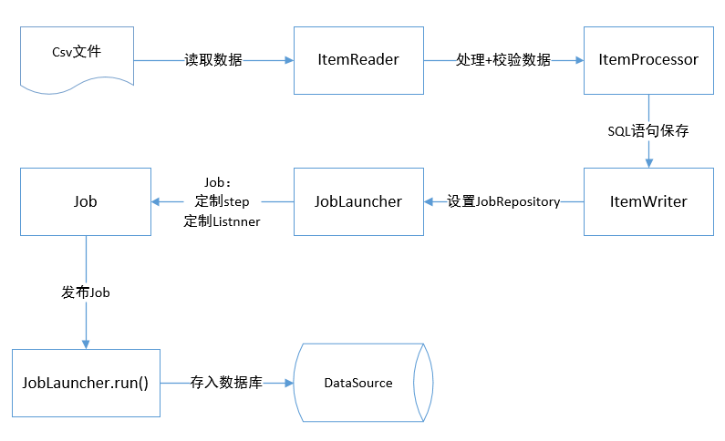
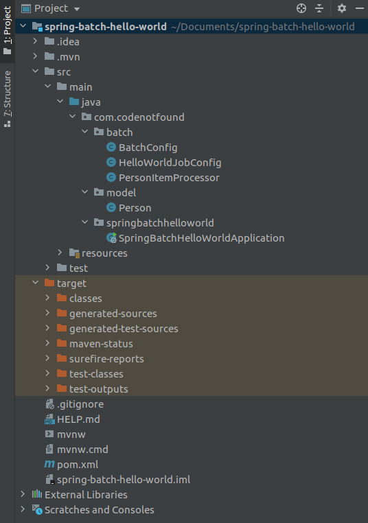

### Flow chart of Batch processing


#### Spring Batch constructed of 7 parts:
1. JobRepository: used for register Job container, set up database properties.
2. JobLauncher: used for start Job interface.
3. Job: the task that need to be excuted.
4. Step: just what it means.
5. ItemReader: read data from file and then map the field.
6. ItemProcessor: used for process data, meanwhile check it.
7. ItemWriter: used for output data, set up datasource, write pre-processing SQL command.

#### The project structure is this:


#### 1 Generate maven project by https://start.spring.io
#### 2 Configure Spring Boot 
``` bash
package com.codenotfound.springbatchhelloworld;

import org.springframework.boot.SpringApplication;
import org.springframework.boot.autoconfigure.SpringBootApplication;
import org.springframework.boot.autoconfigure.jdbc.DataSourceAutoConfiguration;

@SpringBootApplication(exclude = {DataSourceAutoConfiguration.class})
public class SpringBatchHelloWorldApplication {

    public static void main(String[] args) {
        SpringApplication.run(SpringBatchHelloWorldApplication.class, args);
    }
}
```
#### 3 Create model
 save the input data in the src/test/resources/csv/persons.csv
#### 4 Map the data from csv to the Person object
This is a simple POJO containing first name & last name.
``` bash
package com.codenotfound.model;

public class Person {
    private String firstName;
    private String lastName;

    public Person() {
        // default constructor
    }

    public String getFirstName() {
        return firstName;
    }

    public void setFirstName(String firstName) {
        this.firstName = firstName;
    }

    public String getLastName() {
        return lastName;
    }

    public void setLastName(String lastName) {
        this.lastName = lastName;
    }

    @Override
    public String toString(){
        return firstName + " " + lastName;
    }
}
```
#### 5 Create BatchConfig

``` bash
package com.codenotfound.batch;

import org.springframework.batch.core.configuration.annotation.DefaultBatchConfigurer;
import org.springframework.batch.core.configuration.annotation.EnableBatchProcessing;
import org.springframework.context.annotation.Configuration;

import javax.sql.DataSource;

@Configuration
@EnableBatchProcessing
public class BatchConfig extends DefaultBatchConfigurer {

    @Override
    public void setDataSource(DataSource dataSource) {
        // initialize will use a Map based JobRepository (instead of database)
    }
}
```
#### 6 Create HelloWorldJobConfig 


``` bash
package com.codenotfound.batch;

import com.codenotfound.model.Person;
import org.springframework.batch.core.Job;
import org.springframework.batch.core.Step;
import org.springframework.batch.core.configuration.annotation.JobBuilderFactory;
import org.springframework.batch.core.configuration.annotation.StepBuilderFactory;
import org.springframework.batch.item.file.FlatFileItemReader;
import org.springframework.batch.item.file.FlatFileItemWriter;
import org.springframework.batch.item.file.builder.FlatFileItemReaderBuilder;
import org.springframework.batch.item.file.builder.FlatFileItemWriterBuilder;
import org.springframework.batch.item.file.transform.PassThroughLineAggregator;
import org.springframework.context.annotation.Bean;
import org.springframework.context.annotation.Configuration;
import org.springframework.core.io.ClassPathResource;
import org.springframework.core.io.FileSystemResource;

@Configuration
public class HelloWorldJobConfig {

    @Bean
    public Job helloWorldJob(JobBuilderFactory jobBuilders,
                            StepBuilderFactory stepBuilders) {
        return jobBuilders.get("helloWorldJob")
                .start(helloWorldStep(stepBuilders)).build();
    }

    @Bean
    public Step helloWorldStep(StepBuilderFactory stepBuilders) {
        return stepBuilders.get("helloWorldStep")
                .<Person, String>chunk(10).reader(reader())
                .processor(processor()).writer(writer()).build();
    }

    @Bean
    public FlatFileItemReader<Person> reader() {
        return new FlatFileItemReaderBuilder<Person>()
                .name("personItemReader")
                .resource(new ClassPathResource("csv/persons.csv"))
                .delimited().names(new String[] {"firstName", "lastName"})
                .targetType(Person.class).build();
    }

    @Bean
    public PersonItemProcessor processor() {
        return new PersonItemProcessor();
    }

    @Bean
    public FlatFileItemWriter<String> writer() {
        return new FlatFileItemWriterBuilder<String>()
                .name("greetingItemWriter")
                .resource(new FileSystemResource(
                        "target/test-outputs/greetings.txt"))
                .lineAggregator(new PassThroughLineAggregator<>()).build();
    }
}
```
#### 7 Create PersonItemProcessor

``` bash
package com.codenotfound.batch;


import com.codenotfound.model.Person;
import org.springframework.batch.item.ItemProcessor;
import org.slf4j.Logger;
import org.slf4j.LoggerFactory;


public class PersonItemProcessor implements ItemProcessor<Person,String> {
    private static final Logger LOGGER =
            LoggerFactory.getLogger(PersonItemProcessor.class);
    @Override
    public String process(Person person) throws Exception {
        String greeting = "Hello " + person.getFirstName() + " "
                + person.getLastName() + "!";

        LOGGER.info("converting '{}' into '{}'", person, greeting);
        return greeting;
    }
}
```
### 8 Create SpringBatchHelloWorldApplicationTests
``` bash
package com.codenotfound.springbatchhelloworld;

import static org.assertj.core.api.Assertions.assertThat;
import org.junit.Test;
import org.junit.runner.RunWith;
import org.springframework.batch.core.Job;
import org.springframework.batch.core.JobExecution;
import org.springframework.batch.core.launch.NoSuchJobException;
import org.springframework.batch.test.JobLauncherTestUtils;
import org.springframework.beans.factory.annotation.Autowired;
import org.springframework.boot.test.context.SpringBootTest;
import org.springframework.context.annotation.Bean;
import org.springframework.context.annotation.Configuration;
import org.springframework.context.annotation.Import;
import org.springframework.test.context.junit4.SpringRunner;
import com.codenotfound.batch.BatchConfig;
import com.codenotfound.batch.HelloWorldJobConfig;


@RunWith(SpringRunner.class)
@SpringBootTest(
		classes = {SpringBatchHelloWorldApplicationTests.BatchTestConfig.class}
)
public class SpringBatchHelloWorldApplicationTests {

	@Autowired
	private JobLauncherTestUtils jobLauncherTestUtils;

	@Test
	public void testHelloWorldJob() throws Exception {
		JobExecution jobExecution = jobLauncherTestUtils.launchJob();
		assertThat(jobExecution.getExitStatus().getExitCode())
				.isEqualTo("COMPLETED");
	}

	@Configuration
	@Import({BatchConfig.class, HelloWorldJobConfig.class})
	static class BatchTestConfig {

		@Autowired
		private Job helloWorldJob;

		@Bean
		JobLauncherTestUtils jobLauncherTestUtils()
				throws NoSuchJobException {
			JobLauncherTestUtils jobLauncherTestUtils =
					new JobLauncherTestUtils();
			jobLauncherTestUtils.setJob(helloWorldJob);

			return jobLauncherTestUtils;
		}
	}
}
```

### TEST
``` bash 
mvn test
```
IF success, the terminal will show:
``` bash

  .   ____          _            __ _ _
 /\\ / ___'_ __ _ _(_)_ __  __ _ \ \ \ \
( ( )\___ | '_ | '_| | '_ \/ _` | \ \ \ \
 \\/  ___)| |_)| | | | | || (_| |  ) ) ) )
  '  |____| .__|_| |_|_| |_\__, | / / / /
 =========|_|==============|___/=/_/_/_/
 :: Spring Boot ::        (v2.0.1.RELEASE)

[INFO] Tests run: 1, Failures: 0, Errors: 0, Skipped: 0, Time elapsed: 2.514 s - in com.codenotfound.springbatchhelloworld.SpringBatchHelloWorldApplicationTests
2020-08-31 16:57:35.542  INFO 39420 --- [       Thread-1] s.c.a.AnnotationConfigApplicationContext : Closing org.springframework.context.annotation.AnnotationConfigApplicationContext@10163d6: startup date [Mon Aug 31 16:57:34 CST 2020]; root of context hierarchy
[INFO] 
[INFO] Results:
[INFO] 
[INFO] Tests run: 1, Failures: 0, Errors: 0, Skipped: 0
[INFO] 
[INFO] ------------------------------------------------------------------------
[INFO] BUILD SUCCESS
[INFO] ------------------------------------------------------------------------
[INFO] Total time:  9.110 s
[INFO] Finished at: 2020-08-31T16:57:35+08:00
[INFO] ------------------------------------------------------------------------
```

