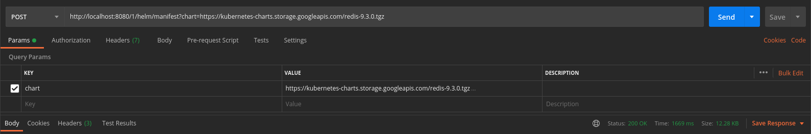

In this project, I use gin web framework, which is written in Golang. It features a martini-like API with performance that is up to 40 times faster thanks to httprouter. Please visit the https://github.com/gin-gonic/gin#using-get-post-put-patch-delete-and-options website for more details.

Now, talk is cheap, here are the codes:
1. As normal, we need a main function:
``` bash
package main

func main() {
    r := setupRouter()
    r.Run(":8080")
}
```

2. Then, the route rule, we setup 2 routes, the "/values" route is used for generating values by using GET method:
``` bash
package main

import (
    "github.com/gin-gonic/gin"
)

var db = make(map[string]string)

// build rule relation
func setupRouter() *gin.Engine {
    // Disable Console Color
    // gin.DisableConsoleColor()
    // r := gin.Default()
    r1 := gin.New()
    r1.Use(gin.Recovery())
    r1.Use(gin.Logger())

    v1 := r1.Group("/1/helm");
    {
        v1.GET("/values",GetValues)
        v1.POST("/manifest",Manifest)
    }

    return r1
}
```
3. The last is the controller:
``` bash
package main

import (
    "basic-gin2/pkg/util/flat"
	"bytes"
	"encoding/json"
	"log"
	"regexp"

	"io"
	"net/http"
	"net/url"

	"strings"

	"github.com/gin-gonic/gin"
	"k8s.io/helm/pkg/chartutil"
	"k8s.io/helm/pkg/engine"
	"k8s.io/helm/pkg/tiller"
	"k8s.io/helm/pkg/timeconv"

	"fmt"

	"path/filepath"

	"github.com/ghodss/yaml"

	hgetter "k8s.io/helm/pkg/getter"
	helmchart "k8s.io/helm/pkg/proto/hapi/chart"
	"text/template"

	"github.com/Masterminds/sprig"
	util "k8s.io/helm/pkg/releaseutil"
	tversion "k8s.io/helm/pkg/version"
)

type Link struct {
    URL string
}

type templateCmd struct {
    values       []string
    stringValues []string
    namespace      string
    valueFiles   []byte
    out          io.Writer
    nameTemplate string
    showNotes    bool
    releaseName  string
    renderFiles  []string
    kubeVersion  string
    outputDir    string
}

// GetValues defined
func GetValues(c *gin.Context) {
    var link Link
    if c.ShouldBind(&link) == nil {
        log.Println(link,URL)
    }
    u, err := url.Parse(link.URL)
    if err != nil {
        c.Error(err)
    }
    httpgetter, err := hgetter.NewHTTPGetter(u.String(), "", "", "")

    if err != nil {
        c.Error(err)
    }

    data, err := httpgetter.Get(u.String())

    if err != nil {
        c.Error(err)
    }

    r := bytes.NewReader(data.Bytes())

    chart, err := chartutil.LoadArchive(r)

    if err != nil {
        c.Error(err)
    }

    // print values
    vls := chartutil.FromYaml(chart.Values.Raw)
    f, err := flat.Flatten(vls, nil)
    if err != nil {
        c.Error(err)
    }
    v, err := json.MarshalIndent(f, " ", "\t")
    if err != nil {
        c.Error(err)
    }

    fmt.Println("json printed successful!")

    c.String(http.StatusOK, string(v))
}

type valueFiles []string

func (v *valueFiles) String() string {
    return fmt.Sprint(*v)
}

func (v *valueFiles) Type() string {
    return "valueFiles"
}

func (v *valueFiles) Set(value string) error {
    for _, filePath := range string.Split(value, ",") {
        *v = append(*v, filePath)
    }
    return nil
}

// Merges source and destination map, preferring values from the source map
func mergeValues(dest map[string]interface{}, src map[string]interface{}) map[string]interface{} {
    for k, v := range src {
        // If the key doesn't exist already, then just set the key to that value
        if _, exists := dest[k]; !exists {
            dest[k] = v
            continue
        }
        nextMap, ok := v.(map[string]interface{})
        // If it isn't another map, overwrite the value
        if !ok {
            dest[k] = v
            continue
        }
        // If the key doesn't exist already, then just set the key to that value
        if _, exists := dest[k]; !exists {
            dest[k] = nestMap
            continue
        }
        // Edge case: If the key exists in the destination, but isn't a map
        destMap, isMap := dest[k].(map[string]interface{})
        // If the source map has a map for this key, prefer it
        if !isMap {
            dest[k] = v
            continue
        }
        // If we got to this point, it is a map in both, so merge them
        dest[k] = mergeValues(destMap,nextMap)
    }
    return dest
}

// vals merges values from files specified via -f/--values and
func vals(valueFiles []byte, values []string, stringValues []string) ([]byte, error) {
	base := map[string]interface{}{}

	// User specified a values files via -f/--values
	for _, filePath := range valueFiles {
		currentMap := map[string]interface{}{}

		var bytes []byte
		var err error
        
		if err != nil {
			return []byte{}, err
		}

		if err := yaml.Unmarshal(bytes, &currentMap); err != nil {
			return []byte{}, fmt.Errorf("failed to parse %s: %s", filePath, err)
		}
		// Merge with the previous map
		base = mergeValues(base, currentMap)
	}
	return yaml.Marshal(base)
}

func generateName(nameTemplate string) (string, error) {
	t, err := template.New("name-template").Funcs(sprig.TxtFuncMap()).Parse(nameTemplate)
	if err != nil {
		return "", err
	}
	var b bytes.Buffer
	err = t.Execute(&b, nil)
	if err != nil {
		return "", err
	}
	return b.String(), nil
}

func checkDependencies(ch *helmchart.Chart, reqs *chartutil.Requirements) error {
	missing := []string{}

	deps := ch.GetDependencies()
	for _, r := range reqs.Dependencies {
		found := false
		for _, d := range deps {
			if d.Metadata.Name == r.Name {
				found = true
				break
			}
		}
		if !found {
			missing = append(missing, r.Name)
		}
	}

	if len(missing) > 0 {
		return fmt.Errorf("found in requirements.yaml, but missing in charts/ directory: %s", strings.Join(missing, ", "))
	}
	return nil
}

// Manifest defined
func Manifest(c *gin.Context) {
	var t templateCmd
	//var link Link
	//Set up engine.
	renderer := engine.New()

	caps := &chartutil.Capabilities{
		APIVersions:   chartutil.DefaultVersionSet,
		KubeVersion:   chartutil.DefaultKubeVersion,
		TillerVersion: tversion.GetVersionProto(),
	}

	id := c.Query("chart")
	u, err := url.Parse(id)
	//fmt.Print("the u string is:\n",u)
	if err != nil {
		c.Error(err)
	}
	
	httpgetter, err := hgetter.NewHTTPGetter(u.String(), "", "", "")

	if err != nil {
		c.Error(err)
	}

	data, err := httpgetter.Get(u.String())

	if err != nil {
		c.Error(err)
	}

	r := bytes.NewReader(data.Bytes())

	chart1, err := chartutil.LoadArchive(r)

	if err != nil {
		c.Error(err)
	}

	l := chart1
	if err != nil {
		c.Error(err)
	} 

    message := c.PostForm("message")
    fmt.Printf(message)
    	// Declared an empty map interface
	var result map[string]*helmchart.Value

	// // Unmarshal or Decode the JSON to the interface.
	json.Unmarshal([]byte(message), &result)
	// get combined values and create config
	rawVals, err := vals(t.valueFiles, t.values, t.stringValues)
	if err != nil {
		c.Error(err)
	}
	fmt.Println(rawVals)

	config := &helmchart.Config{Raw: string(rawVals), Values: result}

	options := chartutil.ReleaseOptions{
		Name:      t.releaseName,
		Time:      timeconv.Now(),
		Namespace: t.namespace,
	}
	vals, err := chartutil.ToRenderValuesCaps(l, config, options, caps)
	if err != nil {
		c.Error(err)
	}

	out, err := renderer.Render(l, vals)
	if err != nil {
		c.Error(err)
	}

	listManifests := []tiller.Manifest{}

	// extract kind and name
	re := regexp.MustCompile("kind:(.*)\n")
	for k, v := range out {
		match := re.FindStringSubmatch(v)
		h := "Unknown"
		if len(match) == 2 {
			h = strings.TrimSpace(match[1])
		}
		m := tiller.Manifest{Name: k, Content: v, Head: &util.SimpleHead{Kind: h}}
		listManifests = append(listManifests, m)
	}

	for _, m := range tiller.SortByKind(listManifests) {
		data := m.Content
		b := filepath.Base(m.Name)
		if !t.showNotes && b == "NOTES.txt" {
			continue
		}
		if strings.HasPrefix(b, "_") {
			continue
		}
		c.String(http.StatusOK, string("---\n# Source: "))
		c.String(http.StatusOK, "%s\n", m.Name)
		c.String(http.StatusOK, string(data))
	}
    fmt.Println("yaml printed successful!")
	c.JSON(200, gin.H{
		"status":  "posted",
		"message": message,
	})
```
### 4 TEST METHOD
(1) For test, use GET method to get the values from the tgz package, e.g. :
``` bash
curl -X GET "localhost:8080/1/helm/values?URL=https://kubernetes-charts.storage.googleapis.com/redis-9.3.0.tgz"
```
and you will get the parsed json in the console(the result is too long,so I cut it down):
``` bash
{
        "cluster.enabled": true,
        "cluster.slaveCount": 2,
        "clusterDomain": "cluster.local",
        "configmap": "# Enable AOF https://redis.io/topics/persistence#append-only-file\nappendonly yes\n# Disable RDB persistence, AOF persistence already enabled.\nsave \"\"",
        "image.pullPolicy": "IfNotPresent",
        "image.registry": "docker.io",
        "image.repository": "bitnami/redis",
        "image.tag": "5.0.5-debian-9-r141",
        "master.affinity": {},
        "master.command": "/run.sh",
        "master.configmap": null,
....
}
```
and use POST method to get the final deployable yaml file, here, I use postman to test the api:

and the final yaml file is(the result is too long, so I just shorten it):
``` bash
---
# Source: redis/templates/secret.yaml
apiVersion: v1
kind: Secret
metadata:
  name: -redis
  labels:
    app: redis
    chart: redis-9.3.0
    release: ""
    heritage: "Tiller"
type: Opaque
data:
  redis-password: "N0dxdjRrTG5Saw=="---
---
.....
---
# Source: redis/templates/metrics-prometheus.yaml
---
{"message":"","status":"posted"}
```
